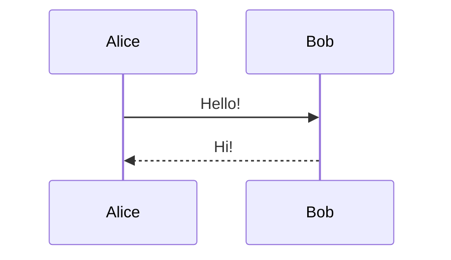

# Blog Post Formats Guide

A quick-reference guide for all supported blog post formats in this al-folio site. Each section shows the required front matter and basic usage.

---

## Front Matter Basics

Every post lives in `_posts/` and is named `YYYY-MM-DD-slug.md`. The minimal front matter is:

```yaml
---
layout: post
title: your post title
date: 2026-01-01 12:00:00
description: a short description
tags: tag1 tag2
categories: sample-posts
---
```

### Common Optional Front Matter Keys

| Key                | Purpose                                 | Example                   |
| :----------------- | :-------------------------------------- | :------------------------ |
| `featured`         | Pin to top                              | `true`                    |
| `thumbnail`        | Thumbnail image path                    | `assets/img/9.jpg`        |
| `related_posts`    | Show related posts                      | `true` / `false`          |
| `redirect`         | Redirect to URL/PDF                     | `/assets/pdf/example.pdf` |
| `giscus_comments`  | Enable Giscus comments                  | `true`                    |
| `disqus_comments`  | Enable Disqus comments                  | `true`                    |
| `citation`         | Make the post citable                   | `true`                    |
| `related_publications` | Show related publications           | `true`                    |
| `pretty_table`     | Enable Bootstrap Tables styling         | `true`                    |

---

## 1. Text Formatting & Links

Standard Markdown — lists, bold, italic, links, blockquotes, horizontal rules, checklists.

```markdown
- bullet item
- [x] checked
- [ ] unchecked

> A blockquote
> — Author

[Link text](https://example.com)
```

---

## 2. Images

Use the `figure.liquid` include inside Bootstrap grid columns. Add `zoomable=true` for lightbox zoom.

```liquid
<div class="row mt-3">
    <div class="col-sm mt-3 mt-md-0">
        
    </div>
</div>
<div class="caption">Caption text here.</div>
```

**Zoomable image:**

```liquid

```

### Advanced: Image Slider & Comparison

Add to front matter:

```yaml
images:
  compare: true
  slider: true
```

**Slider** (uses [Swiper](https://swiperjs.com/)):

```html
<swiper-container keyboard="true" navigation="true" pagination="true" pagination-clickable="true" pagination-dynamic-bullets="true" rewind="true">
  <swiper-slide></swiper-slide>
</swiper-container>
```

**Comparison slider** (uses [img-comparison-slider](https://img-comparison-slider.sneas.io/)):

```html

  
  
</img-comparison-slider>
```

### Photo Galleries

Add to front matter whichever libraries you need:

```yaml
images:
  lightbox2: true
  photoswipe: true
  spotlight: true
  venobox: true
```

---

## 3. Code

Wrap code in fenced code blocks with the language identifier:

````markdown
```python
print("hello world")
```
````

**With line numbers** (Liquid tag):

```liquid

print("hello world")

```

**Code in nested lists:** indent by `3 × bullet_indent_level` spaces.

### Code Diff

Add `code_diff: true` to front matter, then use `` ```diff2html `` for a rich diff view:

````markdown
```diff2html
diff --git a/sample.js b/sample.js
--- a/sample.js
+++ b/sample.js
@@ -1 +1 @@
-console.log("Hello World!")
+console.log("Hello from Diff2Html!")
```
````

---

## 4. Math (MathJax 3)

**Inline:** `$$ E = mc^2 $$` renders inline when placed inside a paragraph.

**Display mode:** place `$$...$$` as its own paragraph, or use `\begin{equation}...\end{equation}` for auto-numbered equations with `\label` / `\eqref`.

```latex
$$
\sum_{k=1}^\infty |\langle x, e_k \rangle|^2 \leq \|x\|^2
$$
```

---

## 5. Diagrams

### Mermaid

Add to front matter:

```yaml
mermaid:
  enabled: true
  zoomable: true
```

Then use `` ```mermaid ``:

````markdown

````

### TikZ (TikZJax)

Add `tikzjax: true` to front matter, then embed TikZ in a script tag:

```html
<script type="text/tikz">
\begin{document}
    \begin{tikzpicture}
        \draw[red,fill=black!60!red] (0,0) circle [radius=1.5];
    \end{tikzpicture}
\end{document}
</script>
```

### Typograms

Add `typograms: true` to front matter, then use `` ```typograms ``:

````markdown
```typograms
+----+
|    |---> My first diagram!
+----+
```
````

---

## 6. Charts

### Chart.js

Front matter: `chart: { chartjs: true }`

Use `` ```chartjs `` with a JSON config object:

````markdown
```chartjs
{
  "type": "line",
  "data": { "labels": ["Jan","Feb"], "datasets": [{"label":"# of bugs","data":[65,59]}] },
  "options": {}
}
```
````

### ECharts

Front matter: `chart: { echarts: true }`

Use `` ```echarts `` with a JSON config.

### Vega-Lite

Front matter: `chart: { vega_lite: true }`

Use `` ```vega_lite `` with a JSON spec.

### Plotly

Front matter: `chart: { plotly: true }`

Use `` ```plotly `` with a JSON config.

---

## 7. Tables (Bootstrap Tables)

Add `pretty_table: true` to front matter, then use standard Markdown tables:

```markdown
| Left aligned | Center aligned | Right aligned |
| :----------- | :------------: | ------------: |
| Left 1       |    center 1    |       right 1 |
```

For advanced tables with pagination/search, use HTML with `data-toggle="table"` and a JSON data source:

```html
<table data-toggle="table" data-url="{{ '/assets/json/table_data.json' | relative_url }}">
  <thead>
    <tr>
      <th data-field="id">ID</th>
      <th data-field="name">Item Name</th>
      <th data-field="price">Item Price</th>
    </tr>
  </thead>
</table>
```

---

## 8. Videos

Use the `video.liquid` include. Supports local files, YouTube, and Vimeo:

```liquid



```

---

## 9. Audios

Use the `audio.liquid` include. Supports local and remote audio files:

```liquid

```

---

## 10. Custom Blockquotes

Styled tip / warning / danger blockquotes:

```markdown
> ##### TIP
>
> A helpful tip goes here.
{: .block-tip }

> ##### WARNING
>
> A warning message.
{: .block-warning }

> ##### DANGER
>
> A danger notice.
{: .block-danger }
```

---

## 11. Table of Contents

**At the beginning of the post:**

```yaml
toc:
  beginning: true
```

**As a sidebar (left or right):**

```yaml
toc:
  sidebar: left
```

---

## 12. Tabs

Add `tabs: true` to front matter, then:

```liquid



Content 1



Content 2



```

---

## 13. Bibliography & Citations

Add `related_publications: true` to front matter. Use `jekyll-scholar` syntax:

```liquid




Quoted text here.

```

---

## 14. Pseudocode

Add `pseudocode: true` to front matter. Use `$$` instead of `$` for math inside the block:

````markdown
```pseudocode
\begin{algorithm}
\caption{Quicksort}
\begin{algorithmic}
\PROCEDURE{Quicksort}{$$A, p, r$$}
    \IF{$$p < r$$}
        \STATE $$q = $$ \CALL{Partition}{$$A, p, r$$}
    \ENDIF
\ENDPROCEDURE
\end{algorithmic}
\end{algorithm}
```
````

---

## 15. GeoJSON Maps

Add `map: true` to front matter, then use `` ```geojson ``:

````markdown
```geojson
{
  "type": "FeatureCollection",
  "features": [{ "type": "Feature", "properties": {}, "geometry": { "type": "Point", "coordinates": [-73.9857, 40.7484] } }]
}
```
````

---

## 16. Jupyter Notebooks

Embed a notebook with the `jekyll-jupyter-notebook` plugin:

```liquid
{::nomarkdown}



  

  <p>Notebook not found.</p>

{:/nomarkdown}
```

---

## 17. Redirect Posts

To redirect a post to a PDF or external URL, use the `redirect` key:

```yaml
---
layout: post
title: a post with redirect
redirect: /assets/pdf/example_pdf.pdf
---
```

---

## 18. Distill-Style Posts

Use `layout: distill` for academic article format with author affiliations, footnotes, and a bibliography file:

```yaml
---
layout: distill
title: a distill-style post
authors:
  - name: Albert Einstein
    url: "https://en.wikipedia.org/wiki/Albert_Einstein"
    affiliations:
      name: IAS, Princeton
bibliography: 2018-12-22-distill.bib
---
```

---

## 19. Twitter Embeds

Use the `jekyll-twitter-plugin`:

```liquid


```

---

## 20. Comments

**Giscus:** add `giscus_comments: true` to front matter.

**Disqus:** add `disqus_comments: true` to front matter.

---

## 21. Citable Posts

Add `citation: true` to front matter. Citation metadata is automatically generated at the bottom of the post.
